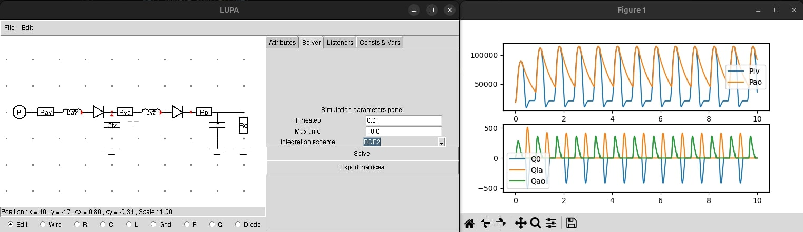

# LUPA – Lumped Parameter Analysis

<div align="center">
  
  
  [](https://www.python.org/downloads/)
  [](LICENSE)
  [](https://github.com/maximerenault/LUPA)
</div>

## Overview

LUPA is a Python-based GUI application for simulating and analyzing lumped-parameter cardiovascular circuits. Built with Python and Tkinter, it provides an intuitive interface for designing, analyzing, and solving lumped-parameter models.

## Why LUPA?

Lumped-parameter modeling is a powerful tool for simulating complex dynamic systems, especially in fields like bioengineering and cardiovascular research. However, most existing software tools are either:
 - difficult to install or configure,
 - lack a user-friendly interface,
 - or are tailored for electrical circuits without flexibility for physiological contexts.

**LUPA** aims to fill this gap by providing an intuitive, open-source application for lumped modeling — combining a visual interface with a robust numerical solver. LUPA is focused on cardiovascular analysis which explains most design choices.

## Features

- **Interactive Circuit Design**: Visual circuit editor with drag-and-drop components
- **Component Library**: Support for various components:
  - Resistors (R)
  - Capacitors (C) 
  - Inductors (L)
  - Diodes (D)
  - Pressure Sources (P)
  - Flow Sources (Q)
  - Ground connections (G)
- **Advanced Solver**: Robust numerical solver for circuit analysis
- **Time-Domain Simulation**: Support for transient analysis
- **Multiple Integration Methods**: BDF (Backwards Differentiation Formula) and BDF2
- **Export Capabilities**: Save and load circuit configurations
- **Real-time Visualization**: Plot results with matplotlib integration

## Installation

### Prerequisites

- Python 3.8 or higher
- pip package manager

### Install Dependencies

```bash
pip install numpy scipy matplotlib pandas networkx
```

### Install via pip (recommended)

```bash
pip install -e .
```

After installation, you can run LUPA from anywhere using:
```bash
lupa
```

### Run from Source

```bash
git clone https://github.com/maximerenault/LUPA.git
cd LUPA
python main.py
```

## Usage

### Command Line Interface

LUPA provides a command line interface with the following options:

```bash
# Start the GUI application
lupa

# Show version
lupa --version

# Show help
lupa --help

# Open a specific circuit file on startup
lupa path/to/circuit.json
```

### GUI Usage

1. **Start the Application**: Run `lupa` or `python main.py` to launch the GUI
2. **Design Your Circuit**: Use the drawing board to place and connect components
3. **Set Parameters**: Configure component values and simulation settings
4. **Solve**: Run the simulation to analyze your circuit
5. **View Results**: Examine the output plots and data
<div align="center">
  
</div>

## Project Structure

```
LUPA/
├── elements/         # Circuit element definitions
├── GUI/              # User interface components
├── solvers/          # Circuit solving algorithms
├── utils/            # Utility functions
├── exceptions/       # Custom exception classes
├── tests/            # Test suite
├── icons/            # Application icons
├── main.py           # Main application entry point
└── pyproject.toml    # Project configuration
```

## Development

### Running Tests

```bash
pytest tests/
```

### Code Formatting

```bash
black .
```

### Type Checking

```bash
mypy .
```

## Contributing

Contributions are welcome! Please feel free to submit a Pull Request.

## License

This project is licensed under the MIT License - see the [LICENSE](LICENSE) file for details.

## Author

**Maxime Renault**
- GitHub: [@maximerenault](https://github.com/maximerenault)

## Acknowledgments

- Built with Python and Tkinter
- Uses NumPy and SciPy for numerical computations
- Matplotlib for visualization
